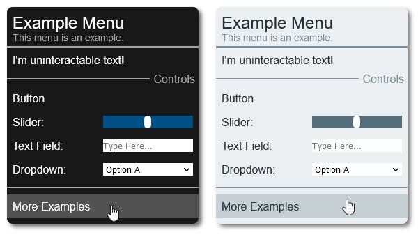

# liteMenu.js Tutorial
liteMenu.js is a lightweight JavaScript library for creating GUI controllers to easily add interaction to your JavaScript program.
This tutorial was written in GitHub markdown, not all markdown renderers support the same features as GitHub's. If you are having trouble viewing this tutorial's formatting view online at: https://github.com/TiiLeaf/liteMenu.js/docs/tutorial.md
## Table of contents
 - [Installing](#installing)
 - [Creating your menu](#creating-your-menu)
 - [Adding content to your menu](#adding-content-to-your-menu)
 - [Interacting with inputs on your menu](#interacting-with-inputs-on-your-menu)
 - [Adding submenus](#adding-submenus)
 - [Changing the appearance of your menu](#changing-the-appearance-of-your-menu)
 - [More features](#more-features)
	 - [Adding content to a different location](#adding-content-to-a-different-location)
	 - [Removing content](#removing-content)
	 - [Toggling visibility](#toggling-visibility)

## Installing
To use liteMenu.js in your project simply load `liteMenu.min.js` and `liteMenu.min.css` in your `<head>` tag using basic `script` and `link` tags. i.e. If you place the built source files from `/build/` directly into your project directory, then use:
```html
<script type="text/javascript" src="liteMenu.min.js"></script>
<link rel="stylesheet" href="liteMenu.min.css"/>
```
## Creating your menu
The core of any liteMenu.js menu is an instance of the `MainMenu` class. To make a menu, create a new instance of this class and call its class methods to add content to the menu.
```javascript
var menu = new MainMenu();
```
## Adding content to your menu
### Headers
To add a header to your menu call `Menu.addHeader(title, subtitle)`. The method's parameter requirements are shown below:
| title (String)     | subtitle (String) (Optional)   |
| :----------------- | :----------------------------- |
| title of your menu | optional subtitle of your menu |

The following code will add a header to our menu with the title `First Menu` and subtitle `A cool menu created with liteMenu.js`.
```javascript
menu.addHeader('First Menu', 'A cool menu created with liteMenu.js');
```
### Plain text
To add plain text to your menu call `Menu.addLabel(text);`. The method's parameter requirements are shown below:
| text (String)    |
|:---------------- |
| The text to add  |

The following code will add text to our menu that says `Hello, world!`.
```javascript
menu.addLabel('Hello, world!');
```
### Buttons
To add a button to your menu call `Menu.addButton(text, onclick);` . The method's parameter requirements are shown below:
| text (String)          | onclick (Function)                                 |
|:---------------------- | :------------------------------------------------- |
| text on the button     | function to execute whenever the button is pressed |

The second parameter can be an inline anonymous function or a reference to any other JavaScript function. The following code will add a button that says `Press ME!` to our menu and define the function `onPress` that will be executed each time the button is clicked.
```javascript
var onPress = function() {
	console.log('Someone just pressed the button!');
}
menu.addButton('Press Me!', onPress);
```
### Sliders
To add a slider to your menu call `Menu.addSlider(text, min, max, step, value, onchange, readout);` The method's parameter requirements are shown below:
| text (String)             | min (Number)   | max (Number)   | step (Number)    | value (Number)        | onchange (Function)                                | readout (Boolean) (Optional)                                |
| :------------------------ | :------------- | :------------- | :--------------- | :-------------------- | :------------------------------------------------- | :---------------------------------------------------------- |
| text label for the slider | slider minimum | slider maximum | slider step size | slider starting value | function to execute whenever the slider is changed | whether or not to add a value readout to the slider's label |

The `Event` object representing the `onchange event` can be accessed in the onchange function. So, an easy way to get the new value of the slider after it is changed is by using `e.target.value`.  If the last optional parameter is set to true, the slider's text will update every-time the slider is changed so that it includes the value of the slider in parentheses. The following code will add a slider labeled `My Slider` to our menu and define the function `sliderChanged` that will be executed each time the slider is changed.
```javascript
var sliderChanged = function(e) {
	console.log('The slider was changed to: ' + e.target.value);
}
menu.addSlider('My Slider', 0, 100, 1, 50, sliderChanged);
```

### Text input fields
To add a slider to your menu call `Menu.addInput(text, onchange);` The method's parameter requirements are shown below:
| text (String)                  | onchange (Function)                                  |
|:------------------------------ | :--------------------------------------------------- |
| text label for the input feild | The function to execute whenever the text is changed |

As seen above in the slider example, and just like any other control, we can access the JavaScript `Event` object in the function passed into `addInput()` and easily get the new value of the text field by using `e.target.value`. The following code will add a text field labeled `Cool Text Field` to our menu and define the function `textChanged` that will be executed each time the text is changed.
```javascript
var textChanged = function(e) {
	console.log('The text was changed to: ' + e.target.value);
}
menu.addInput('Cool Text Field', textChanged);
```
### Dropdown lists
To add a dropdown to your menu call `Menu.addDropdown(text, options, onchange);` The method's parameter requirements are shown below:
| text (String)          | options (Array)              | onchange (Function)                              |
| :--------------------- | :--------------------------- | :----------------------------------------------- |
| label for the dropdown | options in the dropdown list | function to execute whenever an option is chosen |

The following code will add a dropdown labeled `Favorite Letter` with the options `A`, `B`, and `C` to our menu and define the function `dropdownChanged` that will be executed each time an option is chosen.
```javascript
var dropdownChanged = function(e) {
	console.log('The dropdown was changed to: ' + e.target.value);
}
menu.addSlider('Favorite Letter', ['A', 'B', 'C'], dropdownChanged);
```
### Separators
To add a separator call `Menu.addSeparator(text);` The method's parameter requirements are shown below:
| text (String) (Optional)    |
| :-------------------------- |
| text to label the separator |

If no parameter is provided, then a separator will be added without any text label. The following code will add a separator to our menu without any label.
```javascript
menu.addSeparator();
```
## Interacting with inputs on your menu
### Event functions
When you call the function to add any input to your menu, one of the parameters will be a function. This function can be an inline anonymous function, variable reference to a function you defined, or call to any preexisting JavaScript function. The default JavaScript `Event` object representing the relevant event will be automatically provided to the function. An easy way to get the value of the input after it is changed is to accept the `Event` object as a parameter `e` and then use `e.target.value`. See the examples below to decide which type you should use for your situation.
##### Inline Anonymous Function
```javascript
menu.addInput('Text Feild', (e)=>{console.log('Text changed to ' + e.target.value)});
```
##### Variable Reference
```javascript
var textChanged = function(e) {
	console.log('Text changed to ' + e.target.value);
}
menu.addInput('Text Feild', textChanged);
```
##### Normal Call
```javascript
menu.addInput('Text Feild', console.log('Text changed'));
```
### Changing input width
Often you may want to change the default width of an input. For example, increasing the width of a text input field to provide more room to type or decreasing the width of a dropdown list to better suit short option names. To change the width of an input, call the `Menu.setInputWidth(width, newLine);` directly after adding the input to the menu. The parameter requirements of this function are shown below:
| width (String)| newLine (Boolean) (Optional)                                  |
| :------------ | :------------------------------------------------------------ |
| The new width | whether or not the input should be broken out onto a new line |

The width should be provided as a CSS value in string form, any unit works. For example, pass `'70px'` to made the input 70 pixels wide or pass `'100%'` to make the input take up the entire width of the menu. The optional newLine parameter, if set to true, will place the input on a new line directly below its label text. The following code will add a text field labled `A wide text field` and set it's width to fill 100% of the menu's width. The optional newLine flag is necessary in this example because the text field will take up 100% of the menu's width and thus will not fit onto the same line as its label.
```javascript
menu.addInput('A wide text field', func);
menu.setInputWidth('100%', true);
```

## Adding submenus
### Creating the submenu (folder)
Every submenu is represented by its own instance of the `SubMenu` class. When you create a new submenu, you must pass the constructor a refrence to the `MainMenu`. The following code will create a new menu and a folder which can later be populated with content and links to each other.
```javascript
var menu = new MainMenu();
var folder = new SubMenu(menu);
```
### Adding content to the submenu
In liteMenu.js, you add content to submenus the same way you add content to the main menu. For example, to add a button to the submenu we created in the example above we could write the following statement:
```javascript
folder.addButton('Click Me', ()=>{console.log('Button pressed!')});
```
See [Adding content to your menu](#adding-content-to-your-menu) for more details.

#### Submenu Headers
As stated above, you add content to submenus the same way you add content to the main menu. This means you can add headers to submenus by using the same `Menu.addHeader(title, subtitle);` function. Each submenu can have its own header with a unique title and subtitle. However, commonly you may want your submenus' headers to match to make the menu more cohesive. If you want a submenu to have the same header as the main menu, simply call `SubMenu.copyHeader();`. No parameters necessary.

### Linking submenus
To add a submenu to a menu, you use the `Menu.addLink(text, menu);` method. The method accepts two parameters, the first is text that will be used to label the link and the second is a reference to the menu. The same method can be used to add a submenu to a submenu without any limit, or a submenu back to the main menu. In the example above, the following code would create two links, one that points from our main menu to our submenu (labeled `Go to folder`) and another that points from that submenu back to the main menu (labeled `Back`).
```javascript
menu.addLink('Go to folder', folder); //adds a link to the main menu that points to the submenu
folder.addLink('Back', menu); //adds a link to the submenu that points to the main menu
```
### Example
Submenus are perhaps the most complicated feature of liteMenu.js, however, they are still fairly straightforward and an example may help illustrate how they are implemented.
```javascript
//create the menu and two submenus
var menu = new MainMenu();
var folder1 = new SubMenu(menu);
var folder2 = new SubMenu(menu);

//populate the menu with content
menu.addHeader('My Cool Menu');
menu.addLabel('Main Menu');
menu.addButton('Click me!', func);
menu.addLink('Go to slider', folder1); //add a link to folder1 on the main menu
menu.addLink('Go to text input', folder2); //add a link to folder2 on the main menu

//populate folder1 with content
folder1.copyHeader(); //folder1's header will now match menu's
folder1.addSlider('Slider', 0, 100, 1, 50, func);
folder1.addLink('Go back', menu); //add a link to the main menu on folder1

//populate fodler2 with content
folder2.copyHeader(); //folder2's header will now match menu's
folder2.addInput('Type here', func);
folder2.addLink('Go to slider', folder1); //add a link to folder1 on folder2
folder2.addLink('Go back', menu); //add a link to the main menu on the main menu
```
## Changing the appearance of your menu
### The styling method
One goal of liteMenu.js is to be easily and highly customizable. liteMenu.js allows you to customize the apperance of your menu directly through JavaScript with the `MainMenu.styling(styleOptions);` method. This method must be called on the core `MainMenu` instance which represents your menu and not any instances of the `SubMenu` class. All styling changes will still affect submenus. The styling method accepts an object as a parameter which can contain any of the following attributes. You can include or exclude as many attributes as you like.
| Key             | Description                                  | Example value             | Accepted values                                        |
| :-------------- | :------------------------------------------- | :------------------------ | :----------------------------------------------------- |
| position        | location of the menu                         | top-left                  | top-left, top-right, bottom-left, bottom-right, center |
| offset-x        | x displacement of the menu from its position | 10px                      | any CSS length                                         |
| offset-y        | y displacement of the menu from its position | 10px                      | any CSS length                                         |
| width           | width of the menu                            | 275px                     | any CSS length                                         |
| cell-spacing    | individual padding for each item in the menu | 8px                       | any CSS padding rule                                   |
| padding         | padding for the main body of the menu        | 8px 0px 8px 0px           | any CSS padding rule                                   |
| input-size      | the height of inputs                         | 18px                      | any CSS length                                         |
| bg-color        | background color                             | #181818                   | any CSS color                                          |
| fg-color        | color of foreground elements like separators | #AAAAAA                   | any CSS color                                          |
| text-color      | font color                                   | #FFFFFF                   | any CSS color                                          |
| slider-color    | color of slider background                   | #005086                   | any CSS color                                          |
| header-color    | color of the subtitle and header border      | #AAAAAA                   | any CSS color                                          |
| highlight-color | color of buttons when highlighted            | rgba(255, 255, 255, 0.25) | any CSS color                                          |
| font            | font                                         | 'Roboto', sans-serif      | any CSS font-family rule                               |
| font-size       | font size                                    | 16px                      | any CSS length                                         |
| header-align    | text alignment of title and subtitle         | center                    | left, right, center                                    |
| separator-align | text alignment of separators                 | right                     | left, right, center                                    |
| border          | border of the main body of the menu          | none                      | any CSS border rule                                    |
| border-radius   | how much the menu corners should be rounded  | 8px                       | any CSS length                                         |
| shadow          | shadow of the main body of the menu          | none                      | any CSS box-shadow rule                                |

For example, the following code shows a call to `MainMenu.styling(styleOptions);` that will move the menu to the bottom right corner, make it wider, and give it a slightly transparent background color.
```javascript
menu.styling({
	'position': 'bottom-right',
	'width': '330px',
	'bg-color': 'rgba(0, 0, 0, 0.5)'
});
```

### Themes
liteMenu.js also comes with a default light theme and dark theme seen below.



To use an included theme, simply add an attribute to the object passed into `MainMenu.styling(styleOptions);` called `theme` with the value `card-dark` or `card-light`. After a theme is applied, you can override any of its styling options by adding more keys to the object. For example, the following code shows a call to `MainMenu.styling(styleOptions);` that will make the menu look like the dark theme shown above except with a yellow slider bar color and centered text in the header and on separators.
```javascript
menu.styling({
	'theme': 'card-dark', //apply the default dark theme
	//override some of the dark theme's values
	'header-align': 'center', //center titles and subtitles
	'separator-align': 'center', //center separator labels
	'slider-color': 'yellow' //make the slider bar yellow
});
```
## More features
### Adding content to a different location
Whenever you use a method such as `Menu.addButton()` to add content to a menu or submenu, it is automatically appended to the bottom of the menu. If you want to insert content to a different location in the menu call `Menu.setIndex(index);` after adding the content to change where it is added. For example, the following code will add a new button to the top of the menu instead of the bottom.
```javascript
menu.addButton("Click me!", myFunc);
menu.setIndex(0);
```
### Removing content
You can remove content from a menu or submenu by calling `Menu.removeItem(index);` or entirely clear a menu or submenu by calling `Menu.clear();`.
### Toggling visibility
You can show and hide a menu by calling `MainMenu.show();` and `MainMenu.hide();` respectivley. These methods must be called on the core instance of `MainMenu` that is running your liteMenu.js menu, not any `SubMenu` instances.
